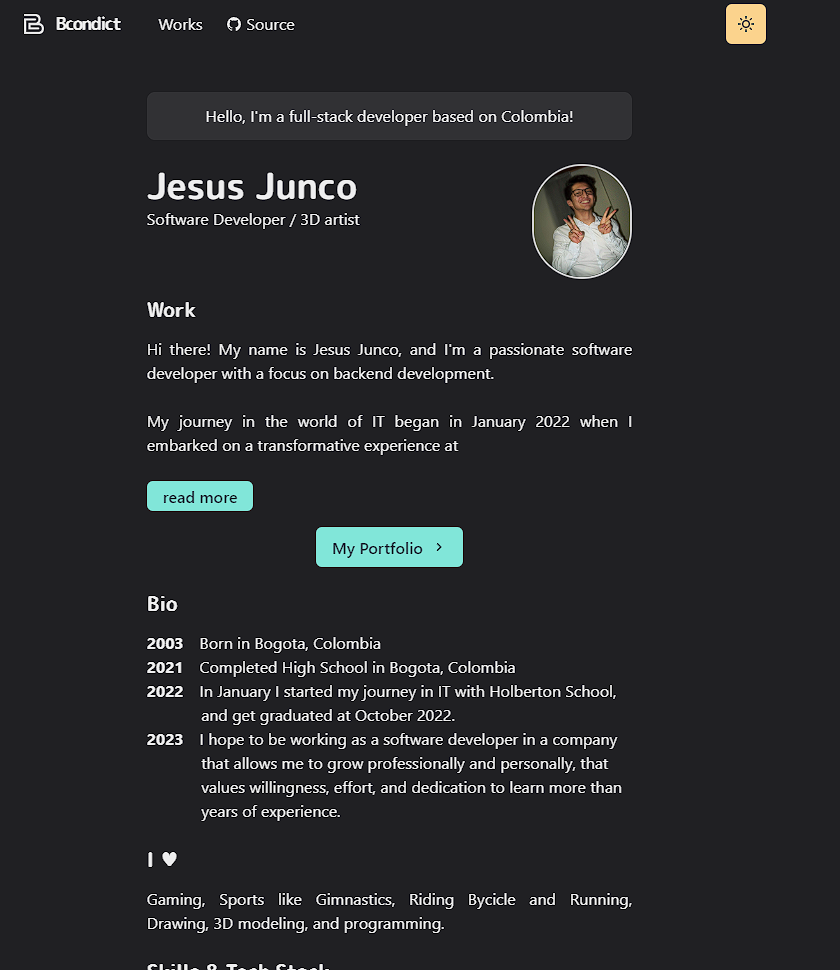

# Portfolio Project V1

This is a web portfolio created using Next.js, React.js, Chakra UI, and Framer Motion. It is a responsive website that can be used as a template for a portfolio. It is also a good example of how to use Next.js, React.js, Chakra UI, and Framer Motion together.

This is based on [Takuya Matsuyama](https://www.craftz.dog/), [Portfolio Project](https://github.com/craftzdog/craftzdog-homepage)

Here you can find more about me and my projects. You can also find my contact information and links to my social media accounts. I hope you enjoy it! 😊

website: [https://protfolio-bcondict.vercel.app/](https://protfolio-bcondict.vercel.app/)

## License

MIT License

You can create your own homepage for free without notifying me by forking this project under the following condition:

- Add a link to [my homepage](https://protfolio-bcondict.vercel.app/)
